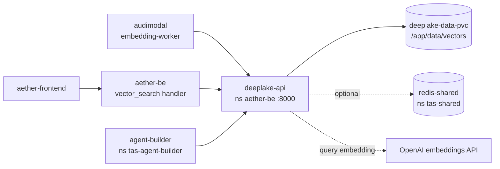

# Tributary AI Services for DeepLake

A self-hosted vector store with an HTTP interface. You create a dataset, tell it how many dimensions your embeddings have, push vectors in with their source text and metadata attached, and ask it for the nearest matches to a query vector. It keeps each dataset in its own directory on disk through the [Deep Lake](https://github.com/activeloopai/deeplake) 4.x library, so there is no external database to run.

## What this is

The capability is nearest-neighbour lookup over embeddings, wrapped in a service so that callers in other languages do not each need a vector library, a storage layout, and a tenancy scheme of their own. Within TAS, `audimodal` writes vectors here at the end of document processing and `aether-be` proxies search queries to it on behalf of the Aether frontend.

What it is *not*: a managed cloud service, and not a drop-in replacement for a dedicated approximate-nearest-neighbour engine. Similarity is computed in Python over a bounded slice of each dataset rather than through an index — see [Sharp edges](#sharp-edges) before you size anything on it. It is also not an embedding service in the general sense: it can embed a *query* string for you when you use the text or hybrid search endpoints, but the vectors you store are ones you computed elsewhere.

Every dataset carries fourteen columns defined at creation time in `app/services/deeplake_service.py:132-147` — `id`, `document_id`, `embedding`, `content`, `chunk_count`, `metadata`, `chunk_id`, `content_hash`, `content_type`, `language`, `chunk_index`, `model`, `created_at`, `updated_at`. Tenancy is a directory prefix: datasets live under `<storage_location>/<tenant_id>/<dataset_name>`.

## Status & scope

**As of 2026-08-26: deployed, healthy, holding real data, and receiving no application traffic.**

Verified against the live cluster today:

- Runs as `deployment/deeplake-api` in namespace `aether-be`, one replica, image `registry-api.tas.scharber.com/deeplake-api:latest`. The pod object dates to 2026-03-18 and has restarted three times; the current process has been running since 2026-07-07.
- It holds 2,952 vectors across three datasets on its PersistentVolumeClaim (PVC) `deeplake-data-pvc`: `documents` (2,481 vectors), `tenant-4c71b774d` (415), `test_audimodal_dataset` (56). All are 1536-dimensional, cosine metric. The most recent dataset was created 2026-02-11 and nothing has been written since.
- Its own request counters, which reset when that process started, show 1,299,717 successful `GET /api/v1/health` calls — all of them kubelet probes — and single-digit counts on every other endpoint. Five of those were dataset requests from a caller that is not the author of this document: three answered `401`, two answered `307`.
- Over the full 30-day Loki retention window there is not one request line that is anything other than a health probe.

The reason for the silence is a credential mismatch, not a code fault. Callers are wired to the right address but not the right key:

| Caller | Key source | State on 2026-08-26 |
|---|---|---|
| `aether-be`, `audimodal-embedding-worker` | `aether-backend-secret` key `DEEPLAKE_API_KEY` (namespace `aether-be`) | 43 characters; does not equal the 64-character key the service accepts |
| `agent-builder` | `agent-builder-secret` key `DEEPLAKE_API_KEY` (namespace `tas-agent-builder`) | empty |

Both were compared by length and equality without printing either value. Until one of them is reconciled with the service's `DEV_DEFAULT_API_KEY`, every authenticated call from TAS lands as a `401`.

The repository itself is close to dormant. Two commits have landed since the previous version of this file was written on 2025-07-25, both in March 2026 and both about that same key plumbing. There is no `.github/workflows/` directory, so nothing tests or builds this on push; the only automation present is a pair of issue templates.

**Shipped and working**, confirmed by running it (see [Quick start](#quick-start)): dataset create/list/read/update/delete, single and batch vector insert, vector similarity search, metadata filtering, per-tenant rate limiting, Redis-backed caching, Prometheus metrics at `/api/v1/metrics/prometheus`, and the auto-generated OpenAPI specification at `/openapi.json` with interactive docs at `/docs`.

**Present in the code and reachable, but not exercised here**: import/export, backup and disaster recovery, hybrid search, Hierarchical Navigable Small World (HNSW) and Inverted File (IVF) index building. The two production datasets do record `index_type: hnsw`.

**Written but not running**: the gRPC server. `app/api/grpc/server.py` defines it and both the Deployment and Service publish port 50051, but `app/main.py:365` starts only the uvicorn HTTP server and nothing calls `GRPCServer.start`. A socket probe inside the running pod today found port 8000 open and ports 50051 and 9091 refusing connections. Treat the gRPC surface as unavailable.

> [!UNVERIFIED] Import/export, backup, hybrid search, and index building were not exercised end to end for this document. Their endpoints are registered and their unit tests pass, but the only evidence they work against real data is the `index_type: hnsw` recorded on the two production datasets.

## Quick start

Verified on this machine on 2026-08-26 against commit `4617003`. Every block below is a real capture.

The Python standard-library `venv` module was not usable on this host, so `uv` is the shortest working path:

```
$ python3 -m venv .venv
The virtual environment was not created successfully because ensurepip is not
available.  On Debian/Ubuntu systems, you need to install the python3-venv
package using the following command.

    apt install python3.12-venv
```

### 1. Install

```bash
uv sync --extra test
```

```
Using CPython 3.13.5
Creating virtual environment at: .venv
Resolved 81 packages in 14ms
 + deeplake==4.2.14
 + fastapi==0.116.1
 + tributary-ai-services-for-deeplake==1.0.0 (from file:///.../rr-deeplake-api)
```

### 2. Run the tests

```bash
uv run pytest -q
```

```
..................ssssss..ss............................................ [ 80%]
..................                                                       [100%]
Required test coverage of 25% reached. Total coverage: 40.35%
82 passed, 8 skipped, 17 warnings in 5.98s
```

The eight skips are integration tests that want a live monitoring stack. The coverage floor of 25% is set in `pyproject.toml:167`.

### 3. Start the service

Two credentials are mandatory before it will serve anything. `JWT_SECRET_KEY` is required at construction — `app/services/auth_service.py:22-23` raises `ValueError("JWT_SECRET_KEY environment variable is required")` without it. `DEV_DEFAULT_API_KEY` is the only API key that survives a restart, because keys live in a process-local dictionary at `app/services/auth_service.py:31`. For local work, mint both:

```bash
export JWT_SECRET_KEY=$(uv run python -c "import secrets; print(secrets.token_urlsafe(32))")
export DEV_DEFAULT_API_KEY=$(uv run python -c "import secrets; print(secrets.token_urlsafe(32))")
export DEEPLAKE_STORAGE_LOCATION=./data/vectors
export HTTP_PORT=8099 HTTP_WORKERS=1 MONITORING_LOG_FORMAT=console
uv run python -m app.main
```

```
2026-08-26T23:31:52 [info    ] Starting HTTP server   [__main__] debug=False host=0.0.0.0 port=8099 workers=1
2026-08-26T23:31:52 [warning ] Failed to initialize cache service [CacheService] error='Error 111 connecting to localhost:6379. Connection refused.'
2026-08-26T23:31:52 [error   ] Failed to initialize rate limit service: Error 111 connecting to localhost:6379. Connection refused. [RateLimitService]
2026-08-26T23:31:52 [info    ] Default tenant and API key created [AuthService] tenant_id=default
2026-08-26T23:31:52 [info    ] DeepLakeService initialized [DeepLakeService] storage_location=./data/vectors
INFO:     Uvicorn running on http://0.0.0.0:8099 (Press CTRL+C to quit)
```

Those two Redis lines are expected without Redis and are not fatal — the service starts and serves with caching and rate limiting switched off. Note that the startup log prints the active API key at info level, so treat these logs as sensitive.

Local development uses `http://localhost:8099` (or `:8000`, the code default). Inside the cluster the address is `http://deeplake-api.aether-be:8000`; there is no public ingress.

### 4. Confirm it is up

Health needs no credential:

```bash
curl -sS http://localhost:8099/api/v1/health | python3 -m json.tool
{
    "status": "healthy",
    "service": "Tributary AI services for DeepLake",
    "version": "1.0.0",
    "timestamp": "2026-08-26T13:32:25.237737",
    "dependencies": {
        "deeplake_storage": "healthy",
        "cache": "disabled"
    }
}
```

Everything else does. **This is the first failure you will hit**, and it looks like a broken service rather than a missing header:

```bash
curl -sS -w '\nHTTP %{http_code}\n' http://localhost:8099/api/v1/datasets/
{"success":false,"message":"Missing authentication credentials","request_id":"18e3af59-ea64-401c-8ebe-306301f6584a"}
HTTP 401
```

The fix is the `Authorization: ApiKey ...` header — note the scheme word is `ApiKey`, not `Bearer`. (`Bearer` is accepted too, but only for a JSON Web Token (JWT) signed with `JWT_SECRET_KEY`.) One more trap: the collection paths need their trailing slash. `POST /api/v1/datasets` answers `307` and redirects to `/api/v1/datasets/`, and curl drops the request body on redirect.

### 5. Store and search a vector

```bash
curl -sS -X POST http://localhost:8099/api/v1/datasets/ \
  -H "Authorization: ApiKey $DEV_DEFAULT_API_KEY" \
  -H 'Content-Type: application/json' \
  -d '{"name":"readme-demo","dimensions":4,"metric_type":"cosine","description":"orientation demo"}'
```

```json
{"id":"readme-demo","name":"readme-demo","description":"orientation demo","dimensions":4,"metric_type":"cosine","index_type":"default","metadata":{},"storage_location":"./data/vectors/default/readme-demo","vector_count":0,"storage_size":0,"created_at":"2026-08-26T23:32:25.267117Z","updated_at":"2026-08-26T23:32:25.267119Z","tenant_id":"default"}
```

```bash
curl -sS -X POST http://localhost:8099/api/v1/datasets/readme-demo/vectors/batch \
  -H "Authorization: ApiKey $DEV_DEFAULT_API_KEY" \
  -H 'Content-Type: application/json' \
  -d '{"vectors":[
        {"id":"v1","document_id":"doc1","values":[0.1,0.2,0.3,0.4],"content":"the cat sat on the mat"},
        {"id":"v2","document_id":"doc2","values":[0.9,0.1,0.0,0.1],"content":"quarterly revenue report"}]}'
```

```json
{"inserted_count":2,"skipped_count":0,"failed_count":0,"error_messages":[],"processing_time_ms":4.864931106567383}
```

```bash
curl -sS -X POST http://localhost:8099/api/v1/datasets/readme-demo/search \
  -H "Authorization: ApiKey $DEV_DEFAULT_API_KEY" \
  -H 'Content-Type: application/json' \
  -d '{"query_vector":[0.1,0.2,0.3,0.4],"options":{"top_k":2}}'
```

Trimmed to the ranking (each result also carries the full stored vector):

```json
{"results":[
  {"vector":{"id":"v1","content":"the cat sat on the mat"},"score":0.9999999848445417,"rank":1},
  {"vector":{"id":"v2","content":"quarterly revenue report"},"score":0.30060180390285723,"rank":2}],
 "total_found":2,"has_more":false,"query_time_ms":8.279561996459961}
```

That is the whole loop. Browse the rest at `http://localhost:8099/docs`.

## How it fits



Three TAS services are configured to call it, all at `http://deeplake-api.aether-be:8000`:

- **`audimodal`** writes vectors as the last step of document processing, through `audimodal/internal/processors/embedding_coordinator.go:96`. Its worker deployment `audimodal-embedding-worker` carries `DEEPLAKE_API_URL` and `DEEPLAKE_API_KEY`.
- **`aether-be`** proxies search on behalf of the Aether frontend — `aether-be/internal/handlers/vector_search.go:505` forwards to `/api/v1/datasets/{id}/search/text`. Configured in `aether-be/k8s/configmap.yaml:58` with `DEEPLAKE_ENABLED: "true"` and 1536 dimensions.
- **`agent-builder`** reads document context from the `documents` dataset, configured in `tas-agent-builder/k8s/configmap.yaml:44`.

Hard dependencies split cleanly:

- **Required to start**: `JWT_SECRET_KEY`, and a writable `DEEPLAKE_STORAGE_LOCATION`. Nothing else. In the cluster that storage is the PVC `deeplake-data-pvc`; lose it and you lose every vector, since there is no replica and no external database behind it.
- **Optional, degrades quietly**: Redis (`redis-shared.tas-shared:6379`). Without it the service logs two errors at startup, reports `"cache": "disabled"` in the health payload, and serves on — with per-tenant rate limiting disabled as a side effect.
- **Required only for text and hybrid search**: an embedding provider for the query string. `app/services/embedding_service.py:175` prefers OpenAI when `EMBEDDING_OPENAI_API_KEY` or `OPENAI_API_KEY` is set and falls back to a local Sentence Transformers model. Plain vector search never touches either.

## Configuration

Settings come from environment variables through `pydantic-settings`, grouped by prefix in `app/config/settings.py`. A `.env` file in the working directory is read for the `DEEPLAKE_`, `REDIS_`, `MONITORING_`, `DEV_` groups and the bare authentication keys. `.env.example` is the template.

The settings that actually change behaviour, with the value running in `aether-be` today where it differs from the code default:

| Variable | Code default | In production | What it does |
|---|---|---|---|
| `DEEPLAKE_STORAGE_LOCATION` | `./data/vectors` | `/app/data/vectors` | Root directory for every dataset. Backed by the PVC in the cluster. |
| `HTTP_PORT` | `8000` | `8000` | HTTP listener. |
| `HTTP_WORKERS` | `4` | `1` | Uvicorn worker processes. Each worker holds its own API-key dictionary, so more than one worker makes runtime-generated keys unreliable. |
| `JWT_SECRET_KEY` | none — startup fails | secret `aether-backend-secret`, key `jwt-secret`, namespace `aether-be` | Signs and verifies bearer tokens. |
| `JWT_EXPIRATION_HOURS` | `8760` (one year) | `24` | Bearer token lifetime. |
| `DEV_DEFAULT_API_KEY` | unset | set inline on the Deployment (see below) | The one API key that survives a restart. |
| `REDIS_URL` | `redis://localhost:6379/0` | `redis://redis-shared.tas-shared:6379/0` | Cache and rate-limit backend. Absent means degraded, not down. |
| `EMBEDDING_OPENAI_API_KEY` | unset | secret `openai-secret`, key `OPENAI_API_KEY`, namespace `aether-be` | Embeds query strings for text and hybrid search. |
| `EMBEDDING_OPENAI_MODEL` | `text-embedding-3-small` | `text-embedding-ada-002` | Both produce 1536 dimensions, which is why the stored datasets are 1536-wide. |
| `PERFORMANCE_MAX_VECTOR_BATCH_SIZE` | `1000` | `1000` | Cap on vectors per batch insert. |
| `MONITORING_METRICS_PORT` | `9090` | `9091` | Declared but unused — no separate metrics listener is started. |

**Where the secrets live.** `JWT_SECRET_KEY` and the callers' `DEEPLAKE_API_KEY` both come from the Kubernetes secret `aether-backend-secret` in namespace `aether-be`; the OpenAI key comes from `openai-secret` in the same namespace; `agent-builder`'s copy is in `agent-builder-secret` in namespace `tas-agent-builder`. Read them with `kubectl get secret -o jsonpath` when you need them; none of their values belong in this repository.

One exception is worth flagging: `DEV_DEFAULT_API_KEY` is set as a **literal inline value** on the `deeplake-api` Deployment rather than pulled from a secret, so it is visible to anyone who can read the Deployment. `deployment/kubernetes/secret.yaml:15` reserves a key for it; the running Deployment does not use it. Moving it there is the obvious fix, and reconciling the callers' copies at the same time would also end the `401` silence described above.

## Sharp edges

These are the ones that cost time, all confirmed today.

**Similarity search does not use an index.** `app/services/deeplake_service.py:531` builds the dataset query below and then re-ranks the returned rows in Python, with an in-code comment recording why: "Deep Lake may not support all distance functions in SQL queries".

```python
search_query = f"SELECT * LIMIT {options.top_k * 10}"  # Get more results to sort later
```

A `top_k=3` request against the 2,481-vector `documents` dataset therefore scores 30 arbitrary rows, not 2,481. Results come back ranked and plausible-looking, so this failure is silent. Recall on any dataset larger than `top_k * 10` is a fraction, and no amount of `index_type: hnsw` on the dataset changes the search path.

**Latency is dominated by the first query.** Measured inside the production pod on 2026-08-26 against `documents` (2,481 vectors, 1536 dimensions): the first search after the dataset was loaded took 1,534 ms; three subsequent searches with fresh random query vectors took 11.1 ms, 11.3 ms and 13.2 ms. Repeating an identical query vector returns the Redis-cached response, including its original recorded `query_time_ms`, so a stable number across repeats means you are timing the cache.

**Text and hybrid search require the dataset width to equal the embedding model's.** They embed the query first, then compare. Against the 4-dimensional demo dataset above:

```
{"success":false,"message":"Embedding dimensions (1536) don't match dataset dimensions (4)"}
HTTP 400
```

The same condition on `/search/hybrid` returns `HTTP 500` with `{"message":"Internal server error"}` instead of that `400`, while logging the identical `Dimension mismatch` warning. The status code is wrong; the cause is the same.

**`uv sync` gives you an install that cannot embed.** `openai` and `sentence-transformers` are listed in `requirements.txt` but absent from the `[project].dependencies` block in `pyproject.toml`, so a `pyproject`-driven install omits both and text search raises `RuntimeError("OpenAI library not installed...")`. The Dockerfile installs from `requirements.txt`, which is why the production image has `openai` 2.14.0 and `sentence-transformers` 5.2.0 and a local `uv sync` does not.

**API keys are process-local.** `AuthService` keeps them in a dictionary (`app/services/auth_service.py:31`) that is rebuilt at every start. Keys minted through `generate_api_key` vanish on restart and are invisible to sibling workers. `DEV_DEFAULT_API_KEY` is the only durable credential.

**Version strings disagree.** `pyproject.toml:7` and the running service both report `1.0.0`; `CHANGELOG.md` documents a `[2.0.0] - 2025-01-19` release. The service is the authority.

**Documentation links overreach.** `docs/README.md` indexes roughly two dozen files, and several of them — `docs/authentication.md`, `docs/features/`, `docs/sdk/` — were never written. The list under [Where to go next](#where-to-go-next) is limited to files that exist.

## Where to go next

Inside this repository:

- [`docs/quickstart.md`](docs/quickstart.md) and [`docs/installation.md`](docs/installation.md) — longer setup paths, including Docker Compose.
- [`docs/api/http/README.md`](docs/api/http/README.md) — endpoint-by-endpoint reference. The generated OpenAPI specification at `/openapi.json` is the authority when the two disagree.
- [`docs/architecture.md`](docs/architecture.md) — how the service layer is arranged internally.
- [`docs/configuration.md`](docs/configuration.md) — the full environment-variable surface, beyond the behaviour-changing subset tabled above.
- [`docs/hybrid-search.md`](docs/hybrid-search.md), [`docs/vector-indexing.md`](docs/vector-indexing.md), [`docs/metadata-filtering.md`](docs/metadata-filtering.md), [`docs/import-export.md`](docs/import-export.md), [`docs/rate_limiting.md`](docs/rate_limiting.md) — the feature areas listed as unexercised above.
- [`docs/troubleshooting.md`](docs/troubleshooting.md), [`docs/reference/error-codes.md`](docs/reference/error-codes.md), [`docs/faq.md`](docs/faq.md) — when a call fails.
- [`docs/disaster_recovery.md`](docs/disaster_recovery.md) and [`docs/deployment/production.md`](docs/deployment/production.md) — backup and cluster deployment.
- [`docs/observability.md`](docs/observability.md), [`docs/monitoring.md`](docs/monitoring.md) — metrics and dashboards.
- [`CONTRIBUTING.md`](CONTRIBUTING.md), [`SECURITY.md`](SECURITY.md), [`ROADMAP.md`](ROADMAP.md) — process. The roadmap predates the March 2026 commits; check it against the status section above before trusting it.

Outside it:

- **Logs**: Grafana Explore against the Loki datasource, `{namespace="aether-be", service="deeplake-api"}`. Per the TAS log rule, do not reach for per-pod log tailing — it misses replicas.
- **Dashboards**: the `DeepLake` folder in Grafana, provisioned from `aether-shared/shared-monitoring/grafana/dashboards/deeplake/`.
- **Cross-service data models**: `aether-shared/data-models/deeplake-api/` for the vector and dataset contracts as the rest of TAS understands them.
- **Callers**: `audimodal/pkg/embeddings/client/deeplake_client.go`, `aether-be/internal/handlers/vector_search.go`.

Licensed under the terms in [LICENSE](LICENSE). Issues and discussions live at the repository and contact addresses recorded in [`tas-info.yaml`](tas-info.yaml).
